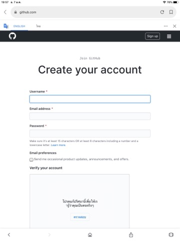

# Python_dataviz
# กฤตยา สังข์ไทย
# 603021853-6

## การใช้งาน python
### 1. การเริ่มต้นใช้งาน
1.1 เปิด Anaconda Prompt

1.2 ใช้คำสั่ง cd "C:\Tangmo\Programming\Python_dataviz" ที่อยู่ของงาน

### 2.  install package ใน python
2.1 matportlib เป็น package ที่ใช้ในการ portกราฟ

คำสั่ง conda install matportlib.

2.2 jupyter notebook ใช้ในการเขียนคำสั่งด้วยภาษา python

คำสั่ง conda install jupyter.

2.3 Pandas
คำสั่ง conda install pandas.

## การใช้งาน Github
ส่วนที่ 1 git online
1. เข้าที่ github.com
2. ทำการลงทะเบียน สำหรับผู้ใช้ใหม่

3. เข้าสู่ระบบ

ส่วนที่ 2 การใช้ git บนเครื่อง
1. ทำการ downlode visual Studio และติดตั้งบนเครื่อง

2. ทำการเชื่อม git ในเครื่อง กับ internet เข้าด้วยกัน
2.1 ไปที่ anaconda prompt
2.2 ทำการเชื่อม git ในเครื่อง เข้ากับ github บท internet
ใช้คำสั่ง git clone ตามด้วยURL 
URL ที่ต้องเชื่อมเอามาจาก github
